# NexTechCommerce — Katalog Produk Responsif

Halaman katalog produk teknologi yang responsif, dibangun dengan **Bootstrap 5** sebagai bagian dari **Tugas Rutin 3 — Katalog Produk Responsif**, mata kuliah Pemrograman Web, Universitas Negeri Medan (UNIMED).

## Struktur File

```
├── index.html   # struktur halaman: navbar, hero, grid katalog (16 produk), footer
├── style.css    # styling kustom di atas Bootstrap, mobile-first
└── README.md
```

## Kesesuaian dengan Ketentuan Tugas

| No | Requirement | Implementasi |
|----|-------------|--------------|
| 1 | Mobile-first approach | `style.css` ditulis dengan style dasar untuk layar kecil, lalu ditingkatkan lewat `@media (min-width: ...)` — bukan sebaliknya |
| 2 | Minimal 3 breakpoint | 3 breakpoint: dasar (**HP**, < 576px), `576px` (**Tablet**), `992px`/`1200px` (**Desktop**) |
| 3 | Grid responsif (1→2→3/4 kolom) | Kelas grid Bootstrap `col-12 col-sm-6 col-lg-4 col-xl-3` pada 16 kartu produk: 1 kolom di HP, 2 di tablet, 3 di laptop, **4 di layar besar (≥1200px) — 4 baris rapi berisi 4 produk** |
| 4 | Card produk (gambar + info + harga + tombol) | `.product-card` berisi gambar, nama produk, rating, deskripsi singkat, harga, dan tombol "Beli Sekarang" |
| 5 | Navbar responsif (hamburger di mobile) | `navbar-expand-md` + `navbar-toggler` Bootstrap, dilengkapi `aria-controls`, `aria-expanded`, `aria-label` untuk aksesibilitas |
| 6 | Responsive images | Semua gambar produk memakai kelas `img-fluid` + `object-fit: cover` agar proporsional di semua ukuran layar |
| 7 | `clamp()` untuk typography | Diterapkan pada `h1` hero, subjudul hero, judul "Daftar Produk", angka statistik, dan harga produk |
| 8 | Footer | `<footer id="kontak">` berisi identitas brand, deskripsi, tautan sosial (Instagram, WhatsApp, Email), dan copyright |
| 9 | Dokumentasi testing (screenshot 3 breakpoint) | Lihat bagian [Dokumentasi Testing](#dokumentasi-testing-responsif) di bawah |

Angka **"16+"** di hero sekarang benar-benar mencerminkan jumlah produk yang ada di katalog (bukan sekadar label).

### Daftar 16 Produk

1. Laptop Performance — Rp 20.500.000
2. Smartphone 5G — Rp 27.000.000
3. Headphone Wireless — Rp 11.500.000
4. Smartwatch Active — Rp 18.200.000
5. Gaming Mouse — Rp 3.500.000
6. Mechanical Keyboard — Rp 4.000.000
7. Monitor IPS 24 Inch — Rp 5.400.000
8. TWS Earbuds — Rp 2.000.000
9. Power Bank 20.000mAh — Rp 750.000
10. SSD External 1TB — Rp 1.350.000
11. Speaker Bluetooth Portable — Rp 850.000
12. Webcam HD 1080p — Rp 650.000
13. Tablet 10 Inch — Rp 3.200.000
14. Router WiFi 6 — Rp 890.000
15. Mini Drone Kamera — Rp 1.750.000
16. Wireless Charging Pad — Rp 420.000

### Nilai Karakter

- **Keberinisiatifan** — melanjutkan Bootstrap yang sudah dipilih sebelumnya, lalu dikustomisasi lewat CSS variables & komponen sendiri (badge, rating, hero stats) alih-alih memakai styling Bootstrap polos.
- **Kemandirian** — komponen seperti `img-fluid`, `navbar-expand-md`, dan grid kolom disusun berdasarkan dokumentasi resmi Bootstrap 5.3.
- **Kepedulian (accessibility)** — skip link ke konten utama, atribut ARIA pada tombol hamburger dan tautan sosial, `alt` deskriptif pada setiap gambar produk, kontras warna teks vs latar yang dijaga, serta indikator fokus (`:focus-visible`) yang terlihat jelas untuk pengguna keyboard.

## Cara Menjalankan

1. Clone repository ini.
2. Buka `index.html` di browser, atau jalankan lewat Live Server.
3. Tidak perlu instalasi tambahan — Bootstrap & Bootstrap Icons dimuat lewat CDN.

## Dokumentasi Testing Responsif

Diuji pada 3 breakpoint utama: **HP, Tablet, dan Desktop**.

*(Tambahkan screenshot hasil pengujian di setiap breakpoint berikut ini)*

### 1. HP (< 576px) — 1 kolom
![Tampilan HP]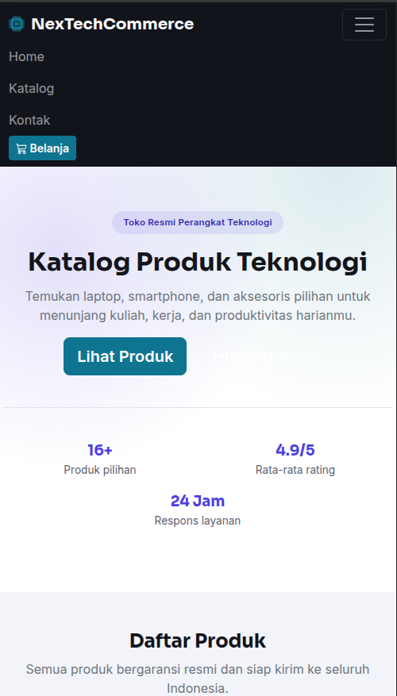
                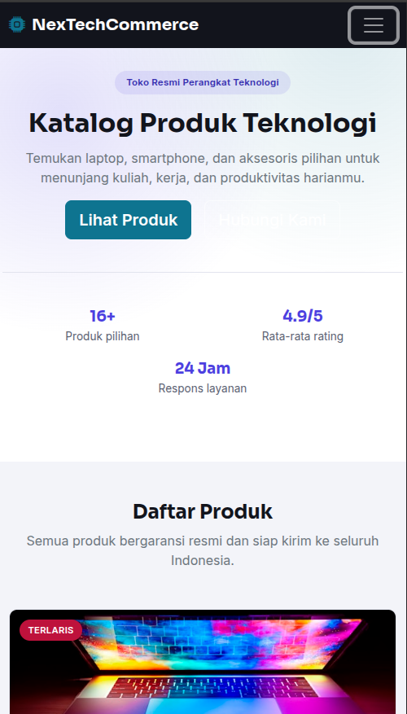
                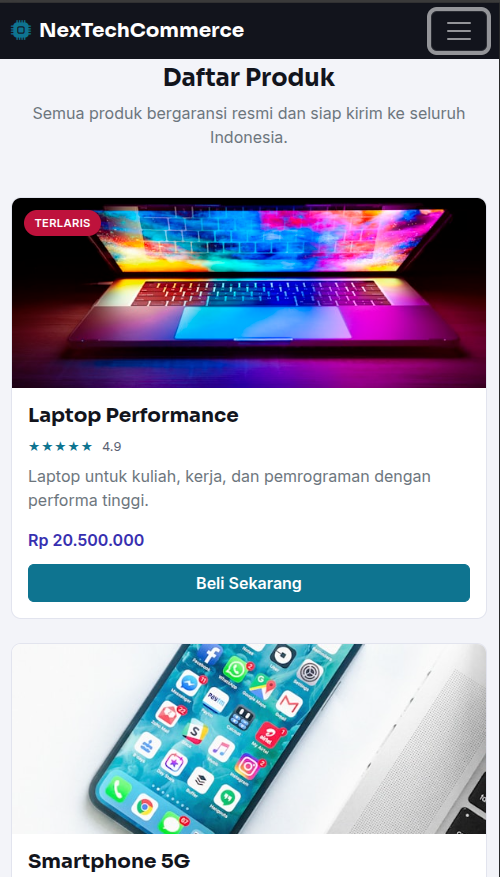
                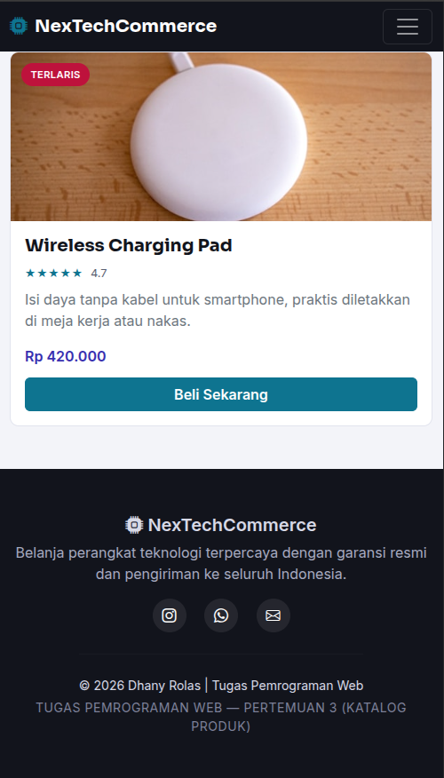

### 2. Tablet (576px – 991px) — 2 kolom
![Tampilan tablet]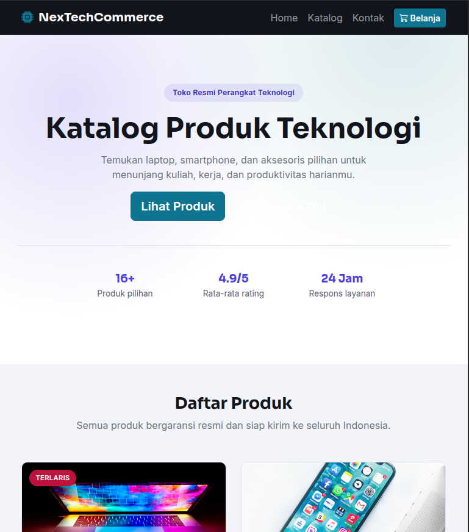
                    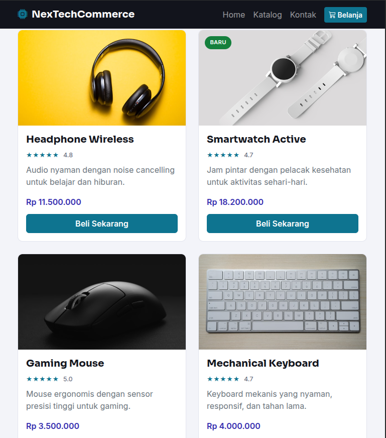
                    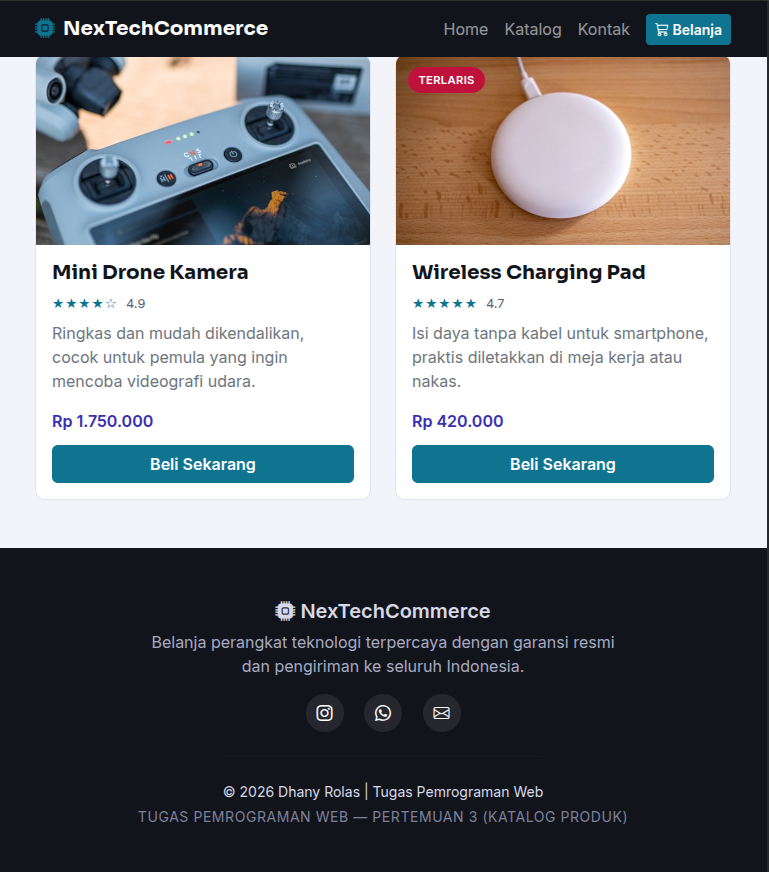

### 3. Desktop (≥ 992px) — 3–4 kolom, rapi hingga 4 baris
![Tampilan desktop]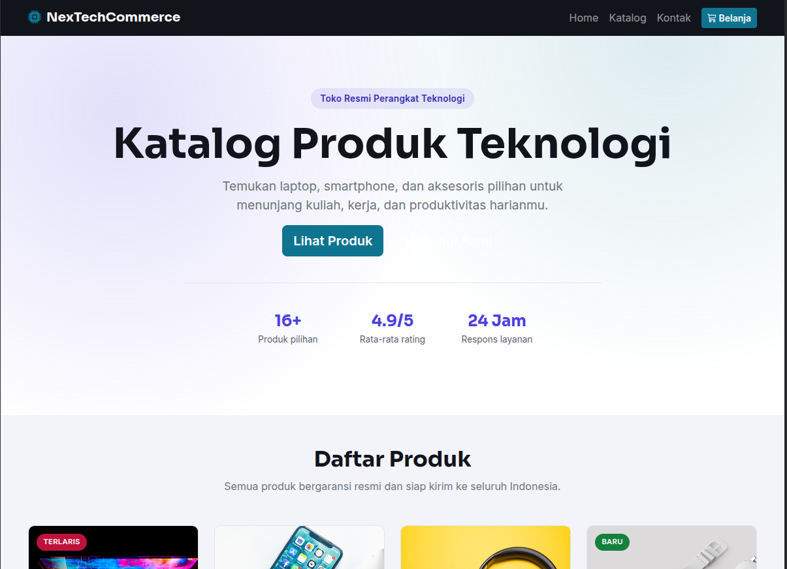
                             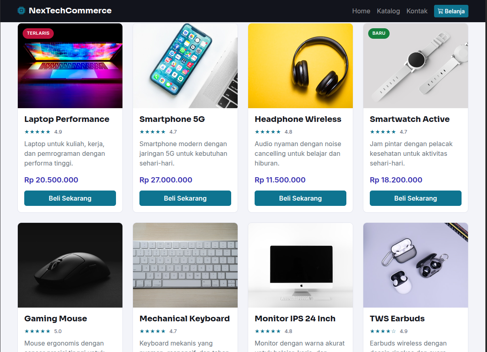
                             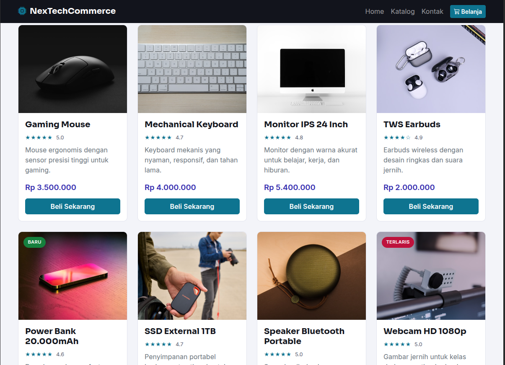
                             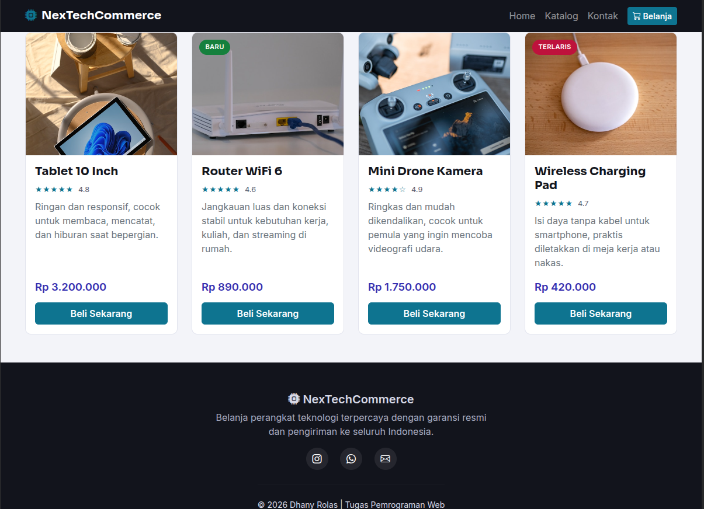
                    

## Developer

**Dhany Rolas**
Mahasiswa Ilmu Komputer, Universitas Negeri Medan